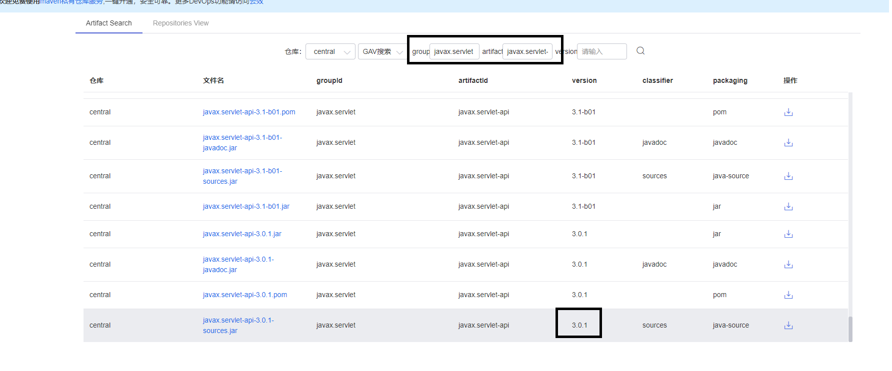
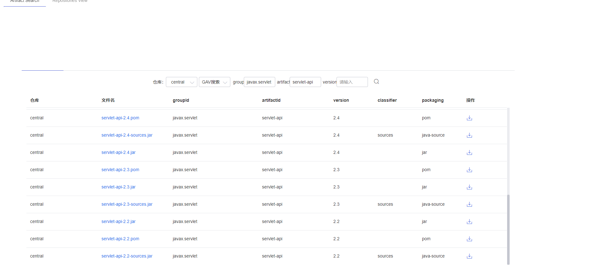

# servlet 3.x 新增特性

## 异步处理支持
Servlet 线程不再需要一直阻塞，直到业务处理完毕才能再输出响应，最后才结束该 Servlet 线程

## 新增 注解支持

## 可插性支持

## 杂项

### servlet-api vs javax.servlet-api
servlet-api和javax.servlet-api groupId一致，都是javax.servlet. **但是,javax.servlet-api 是3.x以上版本，servelt-api是3.x一下版本**

查看maven镜像仓库：central

javax.servlet-api 最低版本是3.0.x

servlet-api 的最低版本是2.2

### filter执行顺序
在servlet 3.x 以上版本且通过非web.xml 实现filter时候无法正确实现执行顺序，
`@WebFilter` 注解中没有order属性或者相关的

在spring中通过注解也无法控制filter执行顺序，
非web.xml下不同servlet容器不同效果（jetty 4.x,tomcat9.x 顺序相同，windfly8.0 不一样，这些仅仅是自己尝试）

