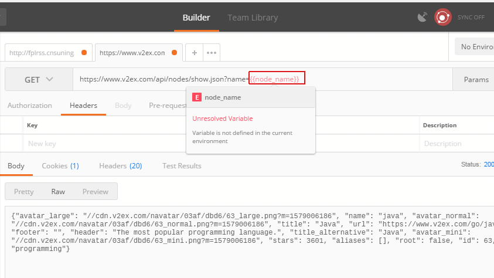
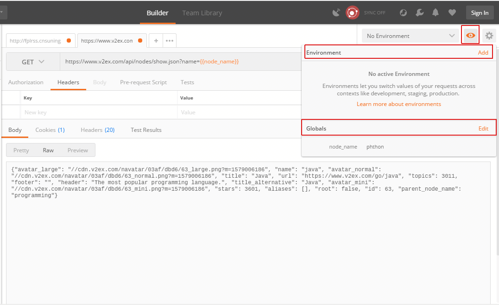
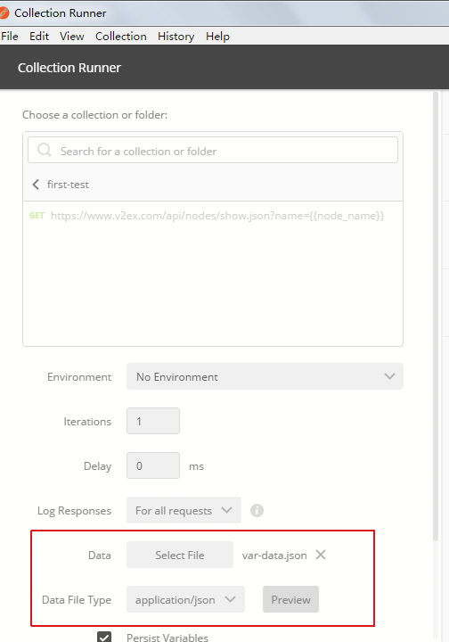

# Postman大秘密

## 变量
>postman 中变量分为全局变量(Environment)和环境变量（Global）

### 语法：
```{{varName}}```

### 操作
1. 在需要用到变量地方使用`{{}}`语法

>postman UI非常出色，这里可以区分是变量且提示没可用变量

2. 在postman builder主界面右上角点击眼界图标，然后展示全局变化和环境变量。如下图所示：


### 脚本
环境变量脚本引用语法：```pm.environment.unset("variable_key");```
全局变量脚本引用语法：```pm.globals.get("variable_key")```

## 参数
### 语法：
```{{varName}}```
>postman支持[变量](#变量)扩展，即每次请求时变量可以是变化且按照预定给出的变量值


### 类型
json,csv
### 用例脚本
参数变量的脚本引用是`data.xxx`

## 参考
[脚本语法](https://learning.postman.com/docs/postman/scripts/test-scripts/)
[postman官方文档](https://learning.postman.com/docs/postman/launching-postman/introduction/)


